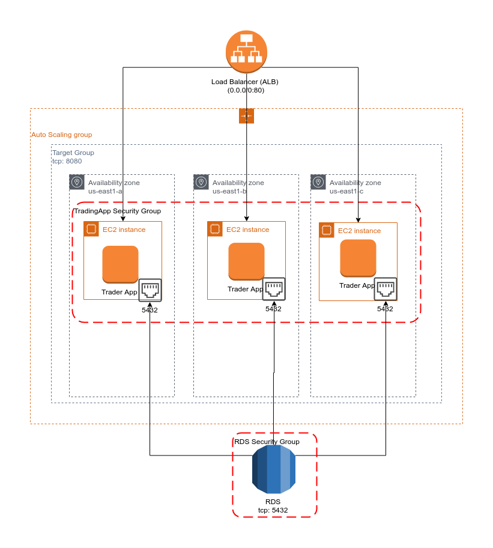

# Introduction
In this cloud/devOps project, we will deploy another project from called [Trading App](https://github.com/mazh-jarvis/trading).

## Trading App
Trading App is a trading microservice application that emulates stock management and trading.

This Java application makes use of a microserver and inversion of control, which make the application robust. It also uses a Postgres database(remote database server) to store relevant data.

# Docker Architecture Diagram


## Docker files
### trading-app
The Trading App's Docker configuration:

1. installs Maven from Docker repository,
1. relocates files of interest to meet maven structure,
1. compiles and packages the *trader app* project
1. installs the minimal version of java development tools
1. finally runs the Trader App executable package, that was just produced using Maven
```dockerfile
    # Build image
    FROM maven:3.6-jdk-8-slim AS build
    COPY src /build/src
    COPY pom.xml /build/
    RUN mvn -f /build/pom.xml clean package -DskipTests

    # Package stage
    FROM openjdk:8-alpine
    COPY --from=build /build/target/trading-1.0-SNAPSHOT.jar /usr/local/app/trading/lib/trading_app.jar
    ENTRYPOINT ["java","-jar","/usr/local/app/trading/lib/trading_app.jar"]
```

### jrvs-psql
The Postgres' Docker configuration:
1. installs the appropriate version of Postgres database package
1. creates the database schema based on a specified DDL source
  ```dockerfile
    FROM postgres
    COPY ./sql_ddl/schema.sql /docker-entrypoint-initdb.d/
```

# Cloud Architecture Diagram


# AWS EB and Jenkins CI/CD Pipeline Diagram
